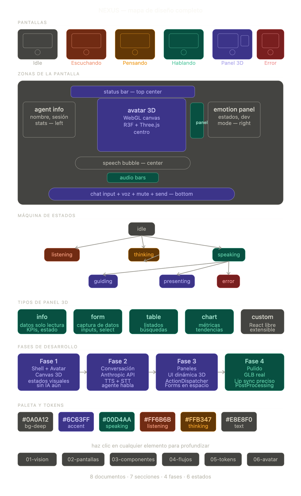

# Agente Inteligente 3D para Aplicaciones Web

Desarrollar un agente virtual interactivo en 3D que viva dentro de una aplicación web y funcione como la interfaz principal entre el usuario y el sistema.

El agente será representado por un personaje 3D animado que existirá dentro de un entorno virtual renderizado en tiempo real mediante WebGL. El personaje podrá desplazarse, orientar la mirada hacia el usuario, reaccionar a eventos, expresar emociones básicas y ejecutar animaciones de comunicación como hablar, señalar, caminar, pensar o presentar información.

La interacción estará basada en lenguaje natural mediante texto y voz. El usuario podrá conversar con el agente para solicitar acciones, navegar por funcionalidades del sistema, completar procesos o recibir asistencia contextual.

El agente actuará además como un controlador visual de la interfaz. En lugar de presentar formularios y componentes de manera tradicional, podrá materializarlos dinámicamente dentro de su entorno, generando paneles, formularios, tarjetas, tablas o componentes React que aparecerán integrados visualmente en el mundo 3D.

Principales capacidades:

* Avatar 3D interactivo con animaciones corporales y faciales.
* Seguimiento de cursor y orientación dinámica de la mirada.
* Conversación mediante voz y texto.
* Sincronización labial y expresiones faciales.
* Sistema de estados (escuchando, pensando, hablando, guiando, mostrando información).
* Generación dinámica de interfaces y formularios.
* Integración con componentes React renderizados dentro del entorno 3D.
* Capacidad de señalar, destacar y explicar elementos visuales.
* Arquitectura extensible para integración con agentes de IA y sistemas empresariales.

La arquitectura técnica estará basada en React, Next.js, Three.js y React Three Fiber, utilizando modelos 3D optimizados para web en formato GLB/GLTF, con un sistema desacoplado entre la lógica del agente, la representación visual y los componentes de interfaz.

El objetivo final es construir una experiencia donde el usuario no interactúe únicamente con formularios tradicionales, sino con un asistente visual inteligente capaz de presentar, explicar y gestionar la información dentro de un entorno inmersivo e interactivo.

